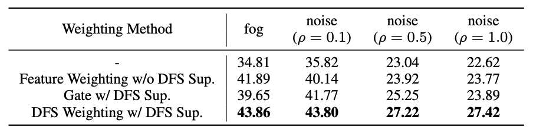

   

# CylinderFusion: Self-Adaptive Cylindrical 3+1D Radar-Camera Fusion for Waterway Point Cloud Segmentation

   
  

## Abstract

Point cloud segmentation is crucial for unmanned vehicle perception on water, and radar–camera fusion further improves its performance. Most existing BEV methods fuse features within cubic voxel space, ignoring the non-uniform distribution of outdoor point clouds and image frustum points. Their performance also degrades severely under adverse weather or sensor malfunctions. To address these, we propose CylinderFusion, a robust radar–camera fusion network. It introduces a novel paradigm for multimodal fusion within cylindrical voxel space and incorporates a specially designed scatter module. To improve robustness, we introduce a Dynamic Feature Selection (DFS) mechanism that adaptively weights features during fusion. Our method achieves state-of-the-art results on the large-scale WaterScenes dataset and demonstrates strong performance on the VoD dataset. Extensive ablations validate its effectiveness.

## Quantitative results

Ablation study for different adaptive fusion strategies on WaterScenes validation set with image enhancement.

## Qualitative results

### Visualization results on [WaterScenes](https://github.com/WaterScenes/WaterScenes) test set

https://github.com/user-attachments/assets/564c7a96-b5f5-4852-85df-48fef4fc5580

Visualization results of different models on the WaterScenes dataset and the image enhancement dataset. Red points represent incorrect predictions, while blue points indicate correct predictions.

### Visualization results on [VoD](https://github.com/tudelft-iv/view-of-delft-dataset) validation set

https://github.com/user-attachments/assets/e49046f6-9d53-4b3e-96ca-bb4dd7e8ef9c

Visualization results on the VoD dataset. Red bounding boxes indicate cyclists, green indicate pedestrians, and blue indicate cars.

## Method

Coming soon.

## Environment

Coming soon.

## Dataset

Coming soon.

## Training and Evaluating

Coming soon.

## Model Zoo

Coming soon.

## Acknowledgements

This project is developed based on [MMDetection3D](https://github.com/open-mmlab/mmdetection3d), licensed under the Apache License 2.0.

Many thanks to the open-source repositories:

- [WaterScenes](https://github.com/WaterScenes/WaterScenes)
- [view-of-delft-dataset](https://github.com/tudelft-iv/view-of-delft-dataset)